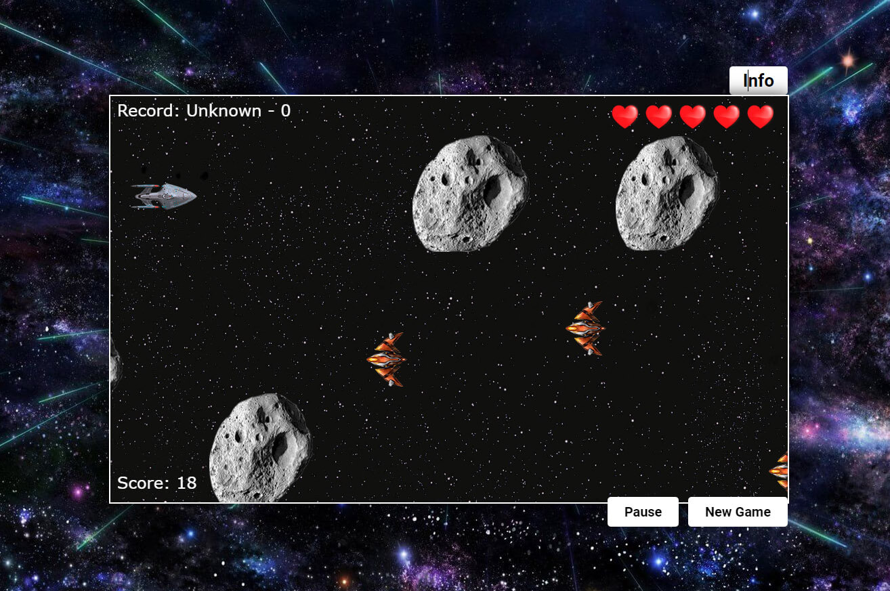

# Браузерная игра: космическая битва

Браузерная игра на ванильном JavaScript и HTML5 (Canvas + window.requestAnimationFrame). Космический корабль пробирается между астероидами и вражескими кораблями. Клавиатурное управление. Есть возможность убивать врага и астероиды, получая за это очки и бонусы. Есть выбор сложности игры и запись имени игрока. Игрок, набравший наибольшее количество очков, записывается в рекордсмены.

### Данное приложение реализует:
* JS
* Canvas API, RequestAnimationFrame

## Деплой проекта

[Нажми и поиграй](https://space-battle-krikun1983.netlify.app/)

#### Управление игры

- Пробел - стрельба;
- Enter - пауза игры;
- Стрелки - движение корабля;

#### Сложность игры

- Easy: шаг 1px;
- Normal: шаг 2px;
- Hard: шаг 4px;

#### Жизни

- Корабль: 5 сердечек;
- Корабль врагов: 2 сердечка;
- Астеройд простой: 4 сердечка;
- Астеройд редкий: 6 сердечек - при разрушении дает жизнь;